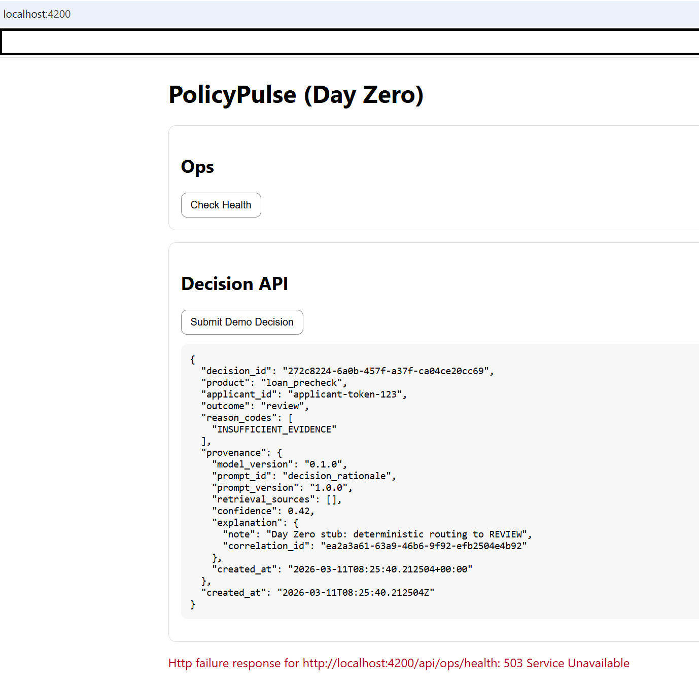
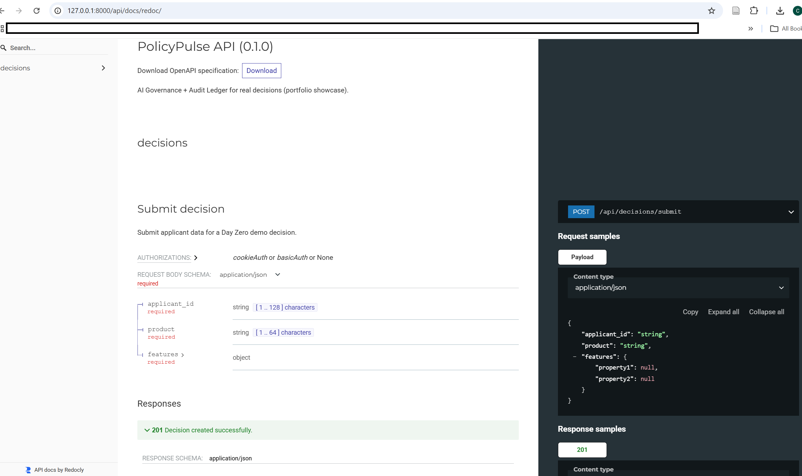
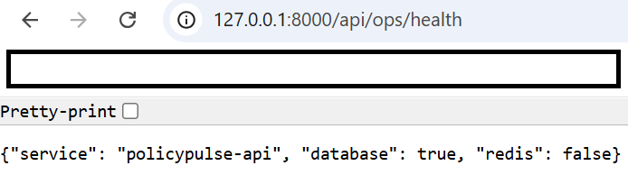

# PolicyPulse — AI Governance + Audit Ledger for Real Decisions

**Educational Purpose & Skills Showcase:** This repository is a portfolio project designed to demonstrate production-grade engineering practices including security-by-design, AI governance, observability, and enterprise-grade type safety. It is not intended for real-world regulatory use without independent security review, legal review, and domain validation.

---

## Overview

PolicyPulse is a RegTech-style decisioning service that records an audit-grade provenance trail for each decision.

The current **Day Zero implementation** demonstrates:

- Django backend with REST endpoints
- OpenAPI documentation via drf-spectacular
- Health endpoint for operational readiness
- Angular frontend using strict TypeScript
- Typed API contracts between frontend and backend
- AI governance scaffolding for prompt management and evaluation

---

## Why This Repository Matters

PolicyPulse is designed to demonstrate how governance-aware AI systems can be built with strong engineering discipline from the start. It combines backend API delivery, typed frontend integration, observability, and governance scaffolding into a single portfolio-grade repository.

This makes the project useful as both:

- a software engineering portfolio artifact
- a RegTech-style architecture demonstration
- a reference for governance-aware application design
- a showcase of secure-by-default development practices

---

## Core Engineering Signals

This repository highlights the following engineering themes:

- **typed frontend-backend contracts** for safer integration
- **OpenAPI-first backend delivery** for documentation and contract clarity
- **health-aware operational design** through dependency checks
- **governance-aware AI scaffolding** for prompts and evaluation artifacts
- **security-by-design practices** including pre-commit and scanning workflows
- **portfolio-grade documentation** supported by screenshots and repository structure

---

## Screenshots

### Frontend Application

Angular frontend running locally.



### API Documentation

OpenAPI documentation served through Redoc.



### Health Endpoint

Operational readiness endpoint reporting service dependencies.



> Note: In local development, Redis may be intentionally unavailable, so the health endpoint may report `"redis": false` or return `503`. This is expected in the current Day Zero setup and demonstrates dependency-aware health reporting.

---

## Architecture

### Backend

- Django
- Django REST Framework
- drf-spectacular (OpenAPI schema + Redoc)
- SQLite for local development
- PostgreSQL-ready via `DATABASE_URL`
- Redis-ready cache configuration

### Frontend

- Angular
- strict TypeScript configuration
- standalone Angular bootstrap
- typed service layer calling the API

### Governance and Operations

- pre-commit hooks
- secret scanning mock
- dependency vulnerability scanning
- prompt catalog scaffolding
- evaluation artifact scaffolding
- correlation ID middleware
- health check endpoint

---

## Repository Layout

```text
policypulse/
│
├── api/                     # Django backend
├── client/                  # Angular frontend
├── ai_governance/           # Prompt catalog + evaluation artifacts
├── docs/adr/                # Architecture decision records
├── infra/                   # Docker / Kubernetes scaffolding
├── scripts/                 # Developer automation scripts
├── screenshots/             # README screenshots
│
├── docker-compose.yml
├── LICENSE
└── README.md
````

---

## Technology Summary

### Backend stack

* Django
* Django REST Framework
* drf-spectacular
* SQLite for local development
* PostgreSQL-ready configuration
* Redis-ready configuration

### Frontend stack

* Angular
* TypeScript
* strict typing
* standalone component bootstrap
* proxy-based local API integration

### Engineering workflow

* pre-commit
* dependency scanning
* governance artifacts
* ADR-oriented documentation
* typed contracts
* health and observability signals

---

## Local Development

### Backend

Run the Django backend:

```powershell
cd api
.\.venv\Scripts\Activate.ps1
python manage.py makemigrations
python manage.py migrate
python manage.py test
python manage.py runserver
```

Backend URLs:

```text
http://127.0.0.1:8000/api/docs/redoc/
http://127.0.0.1:8000/api/ops/health
```

### Frontend

Run the Angular client:

```powershell
cd client\policypulse-client
npm install
npm run lint
ng serve --proxy-config proxy.conf.json
```

Frontend URL:

```text
http://localhost:4200
```

### Stop a running local process

If a terminal command is running and you need to stop it, press:

```text
CTRL + C
```

---

## Recommended Local Verification

After starting backend and frontend, verify the following:

* the Angular application loads in the browser
* the Redoc page renders successfully
* the health endpoint responds
* the frontend can communicate with the backend through the proxy
* typed request and response handling works correctly

---

## Current Day Zero Behavior

### Decision endpoint

```text
POST /api/decisions/submit
```

Current behavior:

* accepts a typed JSON payload
* writes a decision record
* returns deterministic outcome `"review"`
* includes provenance data
* includes a correlation ID

Example response:

```json
{
  "decision_id": "...",
  "product": "loan_precheck",
  "applicant_id": "applicant-token-123",
  "outcome": "review",
  "reason_codes": ["INSUFFICIENT_EVIDENCE"]
}
```

### Health endpoint

```text
GET /api/ops/health
```

Checks:

* database connectivity
* Redis connectivity

Example response:

```json
{
  "service": "policypulse-api",
  "database": true,
  "redis": false
}
```

A `503` status may occur locally if Redis is not running.

---

## API Surface

### Documentation

```text
GET /api/docs/redoc/
```

### Health

```text
GET /api/ops/health
```

### Decisions

```text
POST /api/decisions/submit
```

This API surface demonstrates a minimal but coherent Day Zero decisioning system with typed contracts, audit-oriented outputs, and operational visibility.

---

## Security-by-Design

The repository demonstrates several defensive engineering practices:

* pre-commit hooks blocking obvious credential patterns
* dependency scanning using `pip-audit` and `safety`
* correlation ID tracing for requests
* configurable environment variables for secrets and infrastructure

### Security posture note

This repository is portfolio-grade and engineering-focused. It demonstrates secure development patterns, but it is not represented as production-certified or regulator-approved software.

---

## AI Governance

The repository includes governance scaffolding:

* prompt catalog
* evaluation artifacts
* PII restrictions
* governance ownership and review placeholders

These files demonstrate how LLM systems can be managed with auditability and structured governance.

### Governance intent

The governance layer is included to show that AI-enabled systems should not be treated as only model or API problems. They should also include:

* ownership
* reviewability
* artifact traceability
* controlled prompt evolution
* evaluation evidence

---

## Operational Readiness Notes

The repository includes foundational operational signals:

* documented API surface
* explicit health endpoint
* dependency-aware health behavior
* typed frontend integration
* correlation ID support
* PostgreSQL-ready configuration
* Redis-aware runtime behavior

This is appropriate for a Day Zero repository that aims to show sound engineering direction rather than claim complete enterprise readiness.

---

## Current Project Status

Day Zero includes:

* monorepo scaffold
* Django API
* Angular frontend
* API documentation
* typed contracts
* Git workflow
* governance scaffolding
* developer security tooling

---

## Planned Next Steps

Future improvements include:

* Docker-based local infrastructure
* PostgreSQL and Redis containers
* improved health semantics for local demos
* CI/CD pipeline
* automated prompt evaluation
* GitHub publishing

---

## Suggested Repository Metadata

For a stronger GitHub presentation, use metadata such as:

* **Repository name:** `policypulse`
* **Description:** `AI governance and audit-ledger decisioning service with Django, Angular, OpenAPI, strict typing, and security-aware engineering`
* **Topics:** `django`, `angular`, `typescript`, `openapi`, `drf-spectacular`, `regtech`, `ai-governance`, `audit-trail`, `observability`, `security`, `policy-engineering`

---

## Notes on Secrets

Do not commit:

* real API keys
* real credentials
* production infrastructure secrets
* private environment files containing sensitive values

Use environment-variable templates and safe local placeholders for development.

---

## Summary

PolicyPulse is a portfolio-grade RegTech-style decisioning system that demonstrates:

* Django API delivery
* Angular strict-type frontend integration
* OpenAPI-driven documentation
* dependency-aware operational health checks
* AI governance scaffolding
* security-aware development workflows
* audit-oriented decision provenance patterns

---

## License

This project is licensed under the MIT License.

See the [LICENSE](./LICENSE) file for full details.

---
